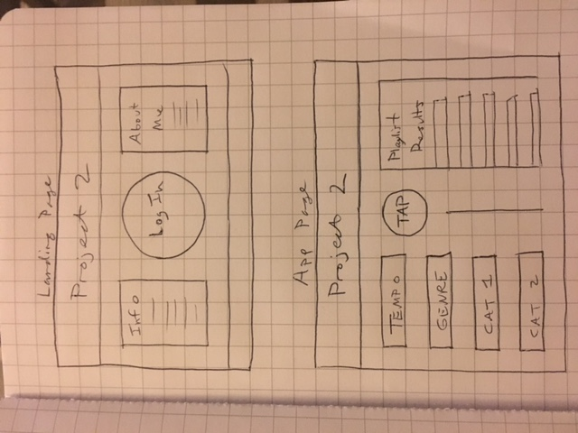
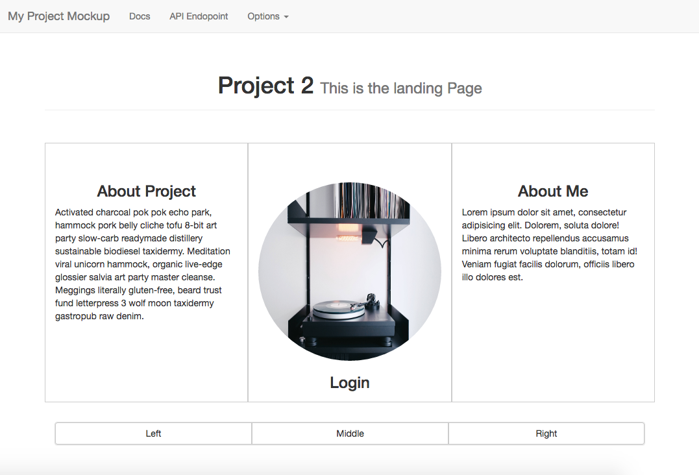

## Project 2

# Songify (Spotify Playlist Generator)

# [Link to the App](https://stormy-waters-85109.herokuapp.com/)

# [Link to my Trello](https://trello.com/b/byU4w5qV/project-2)

Wireframe

Bootstrap Mochup

# Using the App

Songify allows a Spotify user to generate a simple playlist by using one search parameter.  The app needs user credentials to access the app page.  Create a login by entering your email address and a password.  Once logged in, navigate to the app page by clicking on the 'Get Music' link.  Type in a single artist name, then select either 'Album' or 'Top Ten'.  Album will generate the most popular album by the artist (using Spotify stats).  Top Ten will generate the 10 most popular songs by the artist.  You can clear the playlist after each use.
If you click on 'My Searches', all the previous artist searches you have made will be listed along with their Spotify track Id and genre tags.  Hit the delete button to delete any search and remove it from your account.

# Route map

('/') Home page
('/signup') Create a new account
('/login') Login to account
('/songify') App page
('/userpage') Current user's searches
('/searches') Overall DB search history (json data)

# April 18th
After extensive testing of the Spotify API, I decided to use it to make a music app.  I started by building an initial basic server.  I used some hard coded test data and built some REST routes to test the data in the database.  After that, I started on building the passport login side of the server.
It was challenging integrating the server with passport because of all the subfolders and required files.  I worked on going file by file and comparing what needed to be added and required.
I ended the day by getting a single AJAX request to Spotify working by getting an artist's Id.

# April 19th
Heavy API routing all day.  In order to generate a Spotify playlist, I had to get a comma separated list of track Ids to embed into an iFrame player.  First had to get an artist's Id, then get an album from the artist, then get all the tracks from that album, and then package those into the player.  I was able to get this working after extensive testing.

# April 20th
Moved some routes to the server side to send artist Id's back to the front for different requests.  This was needed to create a different type of request for a top ten playlist.  
Challenge: getting conditionals set up to send a route's data to a different function on success.  It involved passing in additonal callback parameters into the previous functions.
Got basic search data into the database, including searching by id in Postman.
Other REST routes were setup on the server side (delete, post, put).

# April 21st
Added a clear button to remove a playlist after generating it.  Works for both top ten and album playlists.
Challenge: getting user data to save searches.  Found out that adding authentication to the route gives me user data (through the next callback).  After that, I created the user model to add the search schema to the database.
Added the searches to a userpage that appends them with html.
Created a delete button to remove a search from the page, however it won't delete from the database yet.

# April 23rd
Finally got delete to remove a search from a user's database.  Needed to use splice after matching the trackId with the user database song id.
Got heroku deployed with no major issues.
Worked a while on the hamburger menu issues in bootstrap.
Challenge: Sourcing metadata and jquery for bootstrap was a challenge because our examples had 3 different ways to do it.  Ended up adding more meta tags on the header partial and on the app and user page.
Added some basic CSS styling with bootstrap integration.
Added a background image.

# Stretch goals:
Add a related artist playlist
Add a playlist by searching with tempo
Get app working on mobile
Add CSS animation for loading playlists

